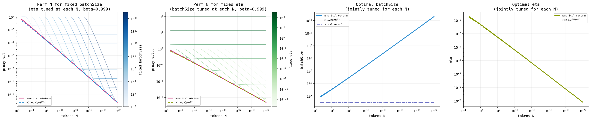
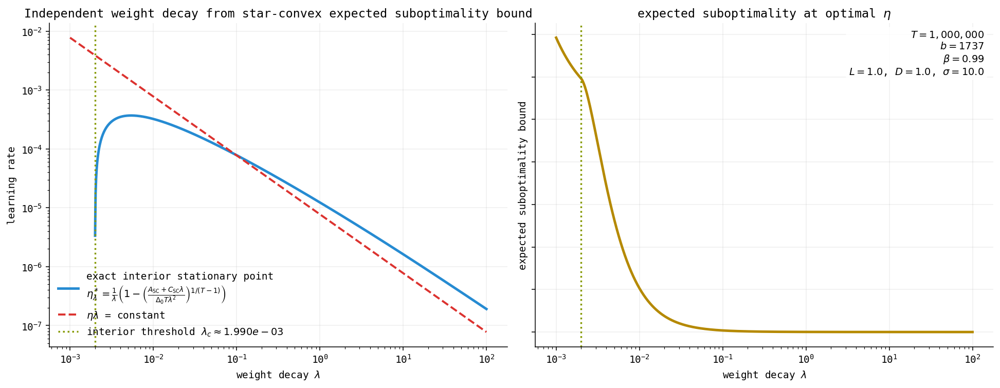

# steepest-descent-lean

Deriving steepest descent convergence bounds and hyperparameter scaling laws from first principles, formalized in Lean.

> Note: This is more of an art project than something production-grade, at least not yet. The main goal is to demonstrate that frontier machine learning optimizations research can now not only be formalized in a proof assistant, but also that a single researcher can do it in mere hours or days, rather than weeks or months for entire research teams.
>
> And while I'm trained in mathematics, I'm not a Lean expert, and this is actually the first time I've formalized any "real" mathematics with it. I mainly used Codex, under heavy supervision by me, to "translate" my blog posts [Ponder: Critical Batch Size for Steepest Descent Under Arbitrary Norms](https://leloykun.github.io/ponder/steepest-descent-crit-bz/) and [Ponder: Convergence Bounds for Steepest Descent Under Arbitrary Norms](https://leloykun.github.io/ponder/steepest-descent-convergence/) into Lean, which you can find in [SteepestDescentOptimizationBounds/](./SteepestDescentOptimizationBounds/). I then asked it to derive hyperparameter scaling laws from those bounds, which you can find in [SteepestDescentScalingLaws/](./SteepestDescentScalingLaws/), and the results matched my (yet unpublished) scaling-law derivations by hand, which was a nice sanity check.
>
> So yah, while I'm confident the mathematics is correct, the Lean code may have hidden "bugs" (e.g. hidden assumptions, strengthenings, weakenings of statements, etc.) that I haven't noticed. Hence why I'm open-sourcing this: if you're a Lean expert, please help me!

> **NOTE:** In my blog post, Assumption 4 states the (local) smoothness of the map $X^\dagger \mapsto \frac{1}{2}\|X^\dagger\|^{\dagger 2}$, but in [Assumptions.lean](./SteepestDescentOptimizationBounds/Assumptions.lean) we use a proxy potential map and its corresponding (smooth) mirror map instead. This is intentional. The latter is more mathematically sound and also more general, perfect for the Lean code. The former, while less rigorous, produces a more digestible proof of Lemma 5 fitting the tone of the blog post. In practice, $D \approx 1$ either way.

## Star-convex expected suboptimality bounds

Let $\eta > 0$ be the learning rate, weight decay parameter $\lambda > 0$ (such that $\lambda\eta \leq 1$), and Nesterov momentum parameter $\beta \in [0, 1)$. Write

$$
E_0^{\mathrm{mom}} := \mathbb{E}\|\nabla f(W_0) - M_0\|^{\dagger}.
$$

Then, under Assumptions 1 to 4 and Assumption 12 in [Ponder: Critical Batch Size for Steepest Descent Under Arbitrary Norms](https://leloykun.github.io/ponder/steepest-descent-crit-bz/), the bounded-weight conditions $\|W_0\| \leq \frac{1}{\lambda}$ and $\|W_*\| \leq \frac{1}{\lambda}$, and arbitrary norm pair $(\|\cdot\|, \|\cdot\|^{\dagger})$, we have

$$
\begin{aligned}
\mathbb{E}\left[f(W_T) - f(W_*)\right]
    &\leq (1 - \lambda\eta)^T \Delta_0 \\
    &\quad+ \frac{2}{\lambda}\left(\sqrt{\frac{1 - \beta}{1 + \beta}}\,\beta + (1 - \beta)\right) \frac{\sqrt{D}\,\sigma}{\sqrt{b}} \\
    &\quad+ \left[
        \frac{4L}{\lambda}\left(1 + \frac{\beta^2}{1 - \beta}\right)
        + \frac{2\beta}{1 - \beta} E_0^{\mathrm{mom}}
    \right]\eta.
\end{aligned}
$$

where $\Delta_0 = f(W_0) - f(W_*)$, and $E_0^{\mathrm{mom}} = \mathbb{E}\|\nabla f(W_0) - M_0\|^{\dagger}$ is the initial expected momentum error.

These star-convex expected-suboptimality results are formalized in [StarConvexExpectedSuboptimality.lean](./SteepestDescentOptimizationBounds/StarConvexExpectedSuboptimality.lean), [StarConvexExpectedSuboptimalityConvergence.lean](./SteepestDescentOptimizationBounds/StarConvexExpectedSuboptimalityConvergence.lean), [StarConvexScalingLawsTheorem1.lean](./SteepestDescentScalingLaws/StarConvexScalingLawsTheorem1.lean), and [StarConvexScalingLawsTheorem2.lean](./SteepestDescentScalingLaws/StarConvexScalingLawsTheorem2.lean).

### Hyperparameter scaling laws derivable from expected suboptimality bounds

**Theorem 1 (Fixed momentum, large horizon proxy).** Fix $\beta \in [0, 1)$ and consider the Expected Suboptimality bound above.

**(1) Iteration scaling.** For fixed large number of training steps $T$ and fixed batch size $b$, the Expected Suboptimality proxy is minimized by

$$
\eta_T^*(b) \propto \frac{\log T}{T}.
$$

Thus at fixed $T$ (ignoring token costs), the optimal learning rate is batch-independent.

**(2) Token-budget scaling.** For fixed token budget $N$, the minimizer of the Expected Suboptimality proxy $(\eta\_T^{\*}, b\_T^{\*})$ satisfies

$$
\begin{aligned}
b_T^* &\propto \left(\frac{N}{\log N}\right)^{2/3}, \\
\eta_T^* &\propto \left(\frac{\log N}{N}\right)^{1/3}.
\end{aligned}
$$

**Theorem 2 (Fixed batch size, large horizon proxy).** At fixed batch size $b$, the minimizer of the Expected Suboptimality proxy $(\eta\_T^{\*}, \beta\_T^{\*})$ satisfies

$$
\begin{aligned}
1 - \beta_T^* &\propto b \left(\frac{\log N}{N}\right)^{2/3}, \\
\eta_T^* &\propto b \frac{\log N}{N}.
\end{aligned}
$$

## Frank-Wolfe expected gap bounds

Let

$$
\mathcal{G}(X)
    := \sup_{\|V\| \leq 1 / \lambda} \langle \nabla f(X), X - V \rangle
    = \langle \nabla f(X), X \rangle + \frac{1}{\lambda}\|\nabla f(X)\|^{\dagger},
$$

Then, under Assumptions 1 to 4 in [Ponder: Critical Batch Size for Steepest Descent Under Arbitrary Norms](https://leloykun.github.io/ponder/steepest-descent-crit-bz/), the bounded-weight conditions $\|W_0\| \leq \frac{1}{\lambda}$ and $\|W_*\| \leq \frac{1}{\lambda}$, and arbitrary norm pair $(\|\cdot\|, \|\cdot\|^{\dagger})$, we have the averaged Frank-Wolfe gap bound

$$
\begin{aligned}
\frac{1}{T}\sum_{t=0}^{T-1}\mathcal{G}(W_t)
    &\leq \frac{\Delta_0}{\lambda \eta T} \\
    &\quad+ \frac{2 E_0^{\mathrm{mom}} \beta}{(1 - \beta)\lambda T} \\
    &\quad+ \frac{2\left(\sqrt{\frac{1 - \beta}{1 + \beta}}\,\beta + (1 - \beta)\right)}{\lambda} \frac{\sqrt{D}\sigma}{\sqrt{b}} \\
    &\quad+ \frac{2L}{\lambda}\left(1 + \frac{2\beta^2}{1 - \beta}\right)\eta,
\end{aligned}
$$

where $\Delta_0 = f(W_0) - f(W_*)$, and $E_0^{\mathrm{mom}} = \mathbb{E}\|\nabla f(W_0) - M_0\|^{\dagger}$ is the initial expected momentum error.

Unlike the Expected Suboptimality layer above, this Frank-Wolfe expected-gap layer does not use the star-convexity assumption (Assumption 12).

This also gives a Lean-friendly best-iterate corollary: there exists some $t < T$ such that $\mathcal{G}(W_t)$ is bounded by the same right-hand side.

### Hyperparameter scaling laws derivable from Frank-Wolfe expected gap bounds

**Theorem 1 (Fixed momentum, large horizon proxy).** Fix $\beta \in [0, 1)$ and consider the Frank-Wolfe expected-gap proxy above.

**(1) Iteration scaling.** For fixed large number of training steps $T$ and fixed batch size $b$, the proxy is minimized by

$$
\eta_T^*(b) \propto T^{-1/2}.
$$

**(2) Token-budget scaling.** For fixed token budget $N$, the minimizer of the Frank-Wolfe expected-gap proxy $(\eta\_T^{\*}, b\_T^{\*})$ satisfies

$$
\begin{aligned}
b_T^* &\propto N^{1/2}, \\
\eta_T^* &\propto N^{-1/4}.
\end{aligned}
$$

**Theorem 2 (Fixed batch size, large horizon proxy).** At fixed batch size $b$, the minimizer of the Frank-Wolfe expected-gap proxy $(\eta\_T^{\*}, \beta\_T^{\*})$ satisfies

$$
\begin{aligned}
1 - \beta_T^* &\propto \sqrt{\frac{b}{N}}, \\
\eta_T^* &\propto b^{3/4} N^{-3/4}.
\end{aligned}
$$

Equivalently, if $N = bT$, the step-based form is

$$
1 - \beta_T^* \propto T^{-1/2},
\qquad
\eta_T^* \propto T^{-3/4}.
$$

These Frank-Wolfe expected-gap results are formalized in [FrankWolfe.lean](./SteepestDescentOptimizationBounds/FrankWolfe.lean), [FrankWolfeExpectedGap.lean](./SteepestDescentOptimizationBounds/FrankWolfeExpectedGap.lean), [FWExpectedGapSLTheorem1.lean](./SteepestDescentScalingLaws/FWExpectedGapSLTheorem1.lean), and [FWExpectedGapSLTheorem2.lean](./SteepestDescentScalingLaws/FWExpectedGapSLTheorem2.lean).

## Frank-Wolfe expected suboptimality bounds

Assume now the Frank-Wolfe KL condition along the iterates:

$$
\mathcal{G}(W_t) \ge \mu_{\mathrm{FW}} \bigl(f(W_t) - f(W_*)\bigr)
\qquad \text{for all } t.
$$

The basic FW-KL recurrence only needs $\mu_{\mathrm{FW}} > 0$. The closed-form
geometric bound below additionally assumes $\mu_{\mathrm{FW}} \lambda \eta \le
1$, so that $1 - \mu_{\mathrm{FW}} \lambda \eta$ is a nonnegative contraction
factor. Under the standing stochastic source, smoothness, and bounded-weight
assumptions, we then have the expected-suboptimality bound

$$
\begin{aligned}
\mathbb{E}[f(W_T) - f(W_*)]
    &\leq (1 - \mu_{\mathrm{FW}}\lambda\eta)^T \Delta_0 \\
    &\quad+ \frac{2}{\mu_{\mathrm{FW}}\lambda}
      \left(\sqrt{\frac{1 - \beta}{1 + \beta}}\,\beta + (1 - \beta)\right)
      \frac{\sqrt{D}\,\sigma}{\sqrt{b}} \\
    &\quad+ \left[
      \frac{2\beta}{1 - \beta} E_0^{\mathrm{mom}}
      + \frac{2L}{\mu_{\mathrm{FW}}\lambda}
        \left(1 + \frac{2\beta^2}{1 - \beta}\right)
    \right]\eta,
\end{aligned}
$$

where $\Delta_0 = f(W_0) - f(W_*)$, and $E_0^{\mathrm{mom}} = \mathbb{E}\|\nabla f(W_0) - M_0\|^{\dagger}$ is the initial expected momentum error.

Unlike the star-convex expected-suboptimality layer, this result does not use the star-convexity assumption. It uses the Frank-Wolfe KL assumption instead.

### Hyperparameter scaling laws derivable from Frank-Wolfe expected suboptimality bounds

The resulting large-horizon exponents match the star-convex expected-suboptimality family, but they are derived here from the Frank-Wolfe KL assumption.

**Theorem 1 (Fixed momentum, large horizon proxy).**

**(1) Iteration scaling.** For fixed large number of training steps $T$ and fixed batch size $b$, the Expected Suboptimality is minimized by,

$$
\eta_T^*(b) \propto \frac{\log T}{T}.
$$

**(2) Token-budget scaling.** For fixed token budget $N$, the minimizer of the Expected Suboptimality $(\eta\_T^{\*}, b\_T^{\*})$ satisfies,

$$
\begin{aligned}
b_T^* &\propto \left(\frac{N}{\log N}\right)^{2/3}, \\
\eta_T^* &\propto \left(\frac{\log N}{N}\right)^{1/3}.
\end{aligned}
$$

**Theorem 2 (Fixed batch size, large horizon proxy).** At fixed batch size $b$, the minimizer of the Expected Suboptimality proxy $(\eta\_T^{\*}, \beta\_T^{\*})$ satisfies

$$
\begin{aligned}
1 - \beta_T^* &\propto b \left(\frac{\log N}{N}\right)^{2/3}, \\
\eta_T^* &\propto b \frac{\log N}{N}.
\end{aligned}
$$

These Frank-Wolfe expected-suboptimality results are formalized in [FrankWolfeExpectedSuboptimality.lean](./SteepestDescentOptimizationBounds/FrankWolfeExpectedSuboptimality.lean), [FWExpectedSuboptimalitySLTheorem1.lean](./SteepestDescentScalingLaws/FWExpectedSuboptimalitySLTheorem1.lean), and [FWExpectedSuboptimalitySLTheorem2.lean](./SteepestDescentScalingLaws/FWExpectedSuboptimalitySLTheorem2.lean).

## Deriving independent weight decay

The independent weight decay rule [(Kosson et al., 2026)](https://arxiv.org/abs/2510.19093v2) can already be read off from our star-convex expected-suboptimality bound.

Fix the training horizon $T$, batch size $b$, momentum $\beta$, and all other theorem coefficients, and vary only the weight decay $\lambda$ and learning rate $\eta$. Then for any given weight decay $\lambda$, the optimal learning rate $\eta^*(\lambda)$ that minimizes the expected-suboptimality bound is given by,

$$
\eta^*(\lambda) = \frac{1}{\lambda} \left( 1 - \left( \frac{ 4L\left(1 + \frac{\beta^2}{1 - \beta}\right) + \frac{2\beta}{1 - \beta}E_0^{\mathrm{mom}}\lambda }{ \Delta_0 T \lambda^2 } \right)^{\!\frac{1}{T-1}} \right).
$$

or, asymptotically,

$$
\eta^*(\lambda) = \Theta\left(\frac{1}{\lambda}\right).
$$

## Discussion

1. **When do the results here hold?**

   The two most important things to consider are (1) the norm to do steepest descent with, and (2) the metric to track.

   Regarding the norm, what this means in practice is that we have to choose optimizers, layers, and parameterizations on our model such that, when composed with the loss function, we get an $L$-Lipschitz objective function $f = \ell \circ \text{model}$. For a single-layer linear model, we can already construct well-known optimizers such as SignSGD (AdamW without accumulation) and Muon (Shampoo without accumulation) from the dualizer of the chosen norm (elementwise max norm and spectral norm for the two examples, respectively) ([Bernstein and Newhouse, 2024](https://arxiv.org/abs/2409.20325)). Multilayer models require more careful design on how to compose the layers and the layerwise norms, but the core idea is the same: we can derive the appropriate optimizer and parameterization from the chosen norm ([Large et al., 2024](https://arxiv.org/abs/2405.14813)).

   Regarding the metric, we currently use Expected Suboptimality bounds directly to derive our convergence bounds and scaling laws. We could instead use Expected Gradient Stationarity as in [Kovalev, 2025](https://arxiv.org/abs/2503.12645) and [Shulgin et al., 2026](https://arxiv.org/abs/2603.15958), or derive convergence bounds from our Expected Suboptimality bounds first as in [Islamov et al., 2026](https://arxiv.org/abs/2603.21191). Last-iterate bounds may be more relevant in practice, but they are more difficult to derive and may not be amenable to purely analytical scaling-law derivations.

## References

1. Franz Cesista and Kaiyue Wen (2025). *Critical Batch Size for Steepest Descent Under Arbitrary Norms*. URL: <https://leloykun.github.io/ponder/steepest-descent-crit-bz/>
2. Franz Cesista (2025). *Convergence Bounds for Steepest Descent Under Arbitrary Norms*. URL: <https://leloykun.github.io/ponder/steepest-descent-convergence/>
3. Jeremy Bernstein and Laker Newhouse (2024). *Old Optimizer, New Norm: An Anthology*. URL: <https://arxiv.org/abs/2409.20325>
4. Tim Large, Yang Liu, Minyoung Huh, Hyojin Bahng, Phillip Isola, Jeremy Bernstein (2024). *Scalable Optimization in the Modular Norm*. URL: <https://arxiv.org/abs/2405.14813>
5. Dmitry Kovalev (2025). *Understanding Gradient Orthogonalization for Deep Learning via Non-Euclidean Trust-Region Optimization*. URL: <https://arxiv.org/abs/2503.12645>
6. Egor Shulgin, Dimitri von Rütte, Tianyue H. Zhang, Niccolò Ajroldi, Bernhard Schölkopf, Antonio Orvieto (2026). *Deriving Hyperparameter Scaling Laws via Modern Optimization Theory*. URL: <https://arxiv.org/abs/2603.15958>
7. Rustem Islamov, Roman Machacek, Aurelien Lucchi, Antonio Silveti-Falls, Eduard Gorbunov, Volkan Cevher (2026). *On the Role of Batch Size in Stochastic Conditional Gradient Methods*. URL: <https://arxiv.org/abs/2603.21191>
8. Atli Kosson, Jeremy Welborn, Yang Liu, Martin Jaggi, Xi Chen (2026). *Weight Decay may matter more than muP for Learning Rate Transfer in Practice*. URL: <https://arxiv.org/abs/2510.19093v2>
